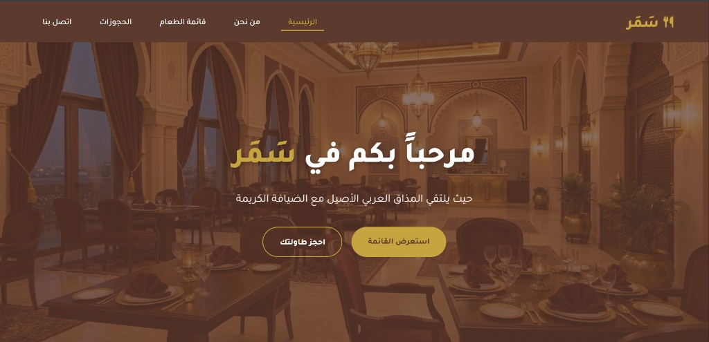

#  مطعم سمر - Samar Restaurant
  

منصة ويب متكاملة للمطاعم الفاخرة

 

### 🌐 [ عرض الموقع مباشرة ](https://mayar-calyx.github.io/Samar/Samar/)
*اضغط على الزر أدناه لتجربة الموقع*

---

## 🚀 عن المشروع (About)
هذا المشروع ليس مجرد كود، بل هو تجربة بصرية كاملة تم بناؤها لتناسب **أرقى المطاعم**.

* 📱 **تصميم متجاوب (Responsive):** يتكيف مع كل الشاشات (موبايل، تابلت، كمبيوتر).
* ⚡ **أداء سريع:** تحميل فوري للصور والقوائم لراحة المستخدم.
* 🎨 **هوية بصرية:** ألوان مدروسة وتنسيق عصري لجذب الزوار.

---

## 🛠️ التقنيات (Tech Stack)

| التقنية | الاستخدام |
| :--- | :--- |
|  | هيكلة وبناء صفحات الموقع |
|  | التصميم، الألوان، والتجاوب |
|  | التفاعل، الحركات، وتجربة المستخدم |

---

## 📖 قصة هذا المشروع (Project Story)

**هذا ليس مجرد كود برمي، بل هو خطوتي الأولى نحو الحلم.** 🚀

بدأ مشروع **"مطعم سمر"** كشرارة تحدٍ مع نفسي. بصفتي مبرمجاً في بداية الطريق، أردت أن أثبت أن السطور البرمجية الجامدة يمكنها أن تتحول إلى تجربة بصرية تنبض بالحياة وتفتح الشهية. 

خلال العمل على هذا المشروع، تعلمت أن البرمجة ليست مجرد كتابة أوامر، بل هي فن تنسيق الألوان، وهندسة المساحات، والتفكير في راحة الزبون الذي سيتصفح هذا الموقع. واجهت تحديات في جعل التصميم متجاوباً وفي ترتيب المكونات، لكن في كل مرة كان يظهر فيها العنصر كما تخيلته، كنت أشعر بمتعة الإنجاز.

**"مطعم سمر"** هو الشاهد الأول على رحلتي، وهو البداية لمشاريع أكبر وأعظم قادمة. 💎

---

> **This isn't just code; it's my first step toward a dream.** 🚀
> 
> "Samar Restaurant" started as a personal challenge. As a beginner developer, I wanted to prove that rigid lines of code could transform into a living, breathing visual experience. This project taught me that programming is art, engineering, and empathy for the user, all in one. It marks the official start of my journey into the world of tech.

---

  
💡 <i>هذا المشروع مفتوح المصدر بموجب رخصة MIT. متاح للتطوير والاستفادة.</i>

